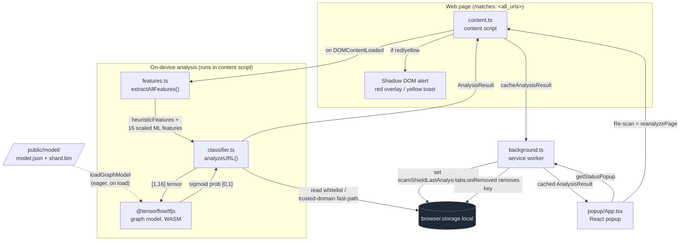

# Architecture

ScamShield is a [WXT](https://wxt.dev)-based browser extension that scores every page
for phishing risk entirely on-device. No page content, URL, or score ever leaves the
browser. It combines rule-based URL/DOM heuristics with a TensorFlow.js neural network.

## System diagram

## Components

### content.ts (content script)
Injected into every page (`matches: ['<all_urls>']`, `cssInjectionMode: 'ui'`).

- Calls `initModelLoader()` immediately so the TF.js model warms up while the page loads.
- Runs `runAnalysis()` on `DOMContentLoaded` (or right away if the DOM is already ready).
- Renders alerts inside an isolated **Shadow DOM** via WXT's `createShadowRootUi`, so
  extension styles never collide with the host page. Two visual modes:
  - **red**: full-screen blocking overlay with "Go Back" / "Proceed (Risky)".
  - **yellow**: top-right toast with "Mark Safe" (adds host to whitelist) / "Ignore".
  - **green**: no UI.
- Sends each result to the service worker via `cacheAnalysisResult`.
- Listens for `reanalyzePage` (from the popup) to re-run on demand.

### features.ts (feature extraction)
Pure function `extractAllFeatures(url, dom)` returning:

- **heuristicFeatures**: human-readable flags `isHTTP`, `length`, `hasForms`
  (password input present), `isEdu`, `hostname`, `hasHomograph`.
- **scaledMlFeatures**: 16 numeric URL features (lengths, character counts, IP-literal
  flag, https flag) min-max scaled with `SCALER_MIN_ARRAY` / `SCALER_SCALE_ARRAY`.
  These constants must match the training run.

Homograph detection (`isPotentialHomograph`) flags any `xn--` Punycode label, mixed
Latin+Cyrillic hostnames, and a set of Cyrillic confusable characters.

### classifier.ts (orchestration and scoring)
`analyzeURL(url, dom)` pipeline:

1. Read the user **whitelist** from `browser.storage.local`; a whitelisted host returns green instantly.
2. **Trusted-domain fast-path** (`GLOBALLY_TRUSTED_DOMAINS`) returns green, unless the hostname
   shows a homograph signal.
3. **Heuristic score (0-150):** +20 long URL, +20 many hyphens, +40 HTTP, +30 password
   form, -20 `.edu` discount, +60 homograph; clamped.
4. **ML inference:** build a `[1,16]` tensor, run the graph model (`execute`) or layers model
   (`predict`), read the sigmoid probability.
5. **Blend:** `final = 0.3*heuristic + 0.7*(ML*100)`. Independent escalation: if ML >= 90%
   or heuristic >= 70, that value forces the score up via `Math.max`.
6. **Map to mode:** green below 30, yellow 30-70, red above 70.

Model loading (`loadModel`) tries `tf.loadGraphModel` first, falls back to
`tf.loadLayersModel`, then warms up with a zero tensor. The shipped model is a graph model.

### background.ts (service worker)
- Handles `cacheAnalysisResult` by writing `scamShieldLastAnalysis_<tabId>`.
- Handles `getStatusPopup` by returning the cached result for the active tab.
- Cleans up the per-tab key on `tabs.onRemoved`.
- Keeps the message channel open with `return true` for async `sendResponse`.

### popup/App.tsx (React popup)
On mount it requests `getStatusPopup` and renders the cached score, mode, and URL.
"Re-scan" sends `reanalyzePage` to the active tab's content script, then re-fetches
after about a second.

## ML model
- Format: TF.js **graph model** (`public/model/model.json` + `group1-shard1of1.bin`).
- Architecture: `Input(16) -> Dense(32, relu) -> Dense(16, relu) -> Dense(1, sigmoid)`
  (verified from weight shapes `[16,32] [32,16] [16,1]`).
- Trained in Google Colab on 364,198 URLs (201,736 legit + 162,462 phishing), 80/20 split,
  10 epochs, 88.47% test accuracy. Inference runs on the TF.js WASM backend
  (CSP allows `wasm-unsafe-eval`).
- Declared in `web_accessible_resources` so the content script can fetch it via
  `browser.runtime.getURL`.

## Storage keys

| Key | Value |
|-----|-------|
| `scamShieldWhitelist` | `string[]`, hostnames the user marked safe |
| `scamShieldLastAnalysis_<tabId>` | `AnalysisResult`, last result per tab (cleared on tab close) |

## Permissions
`storage` (cache and whitelist) and `tabs` (popup active-tab lookup and message routing).
