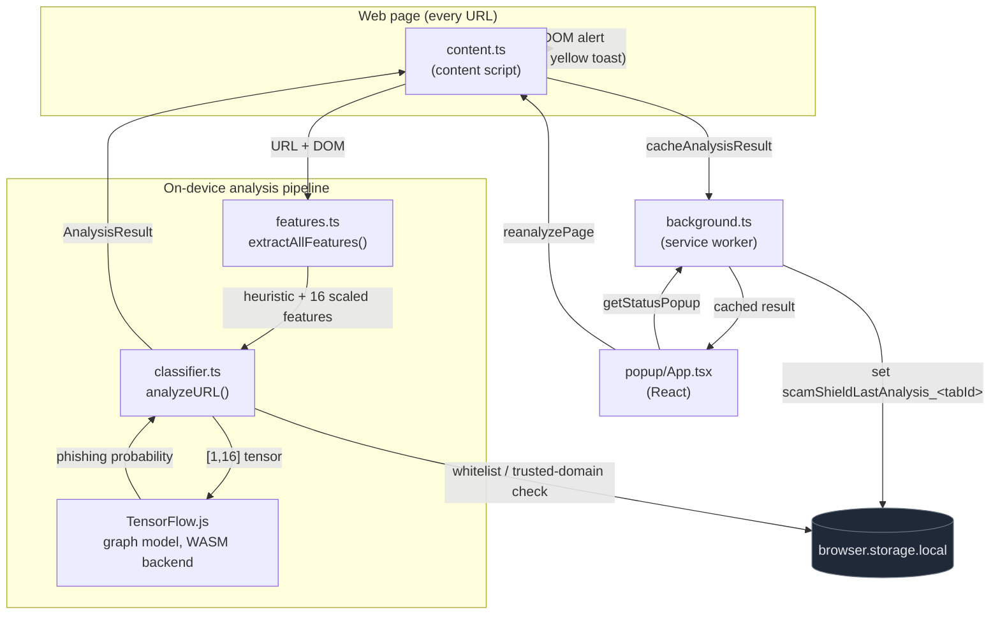

# ScamShield


A browser extension that detects phishing and scam websites using on-device machine learning inference (TensorFlow.js) combined with URL heuristics. No data leaves your browser.

## How it works

Every page you visit is scored in two stages:

1. **Heuristic analysis**: checks URL/DOM signals like HTTP vs HTTPS, URL length, excessive hyphens, password form presence, homograph characters in the hostname, and the `.edu` domain discount.
2. **ML inference**: a TensorFlow.js model (trained on 364k URLs) predicts phishing probability from 16 scaled URL features.

Final score = `30% heuristic + 70% ML`. Strong heuristic signals (≥70) and high ML confidence (≥90%) can each independently escalate the result to red regardless of the blend.

| Score | Mode | Meaning |
|-------|------|---------|
| 0-29 | Green | Appears safe |
| 30-70 | Yellow | Suspicious, proceed with caution |
| 71-100 | Red | High risk, leave the page |

## Architecture



See [ARCHITECTURE.md](ARCHITECTURE.md) for a component-level breakdown.

## ML model

- Architecture: `Input(16) → Dense(32, relu) → Dense(16, relu) → Dense(1, sigmoid)`
- Training set: 364,198 URLs (201,736 legitimate, 162,462 phishing), 80/20 split, 10 epochs
- Test accuracy: 88.47%
- Inference runs entirely on-device via the TF.js WASM backend

## Development

```powershell
npm install
npm run dev          # Chrome with extension loaded
npm run dev:firefox
npm run build
npm run build:firefox
npm run zip          # Package for Chrome Web Store
npm run compile      # TypeScript check only
```

Requires Node 18+.

## Retraining the model

The model was trained in Google Colab. To retrain: extract the same 16 URL features (see `utils/features.ts`), apply MinMaxScaler normalization, then convert the Keras model with `tensorflowjs_converter`. Copy the new scaler min/range arrays into `utils/features.ts` (`SCALER_MIN_ARRAY` and `SCALER_SCALE_ARRAY`).
